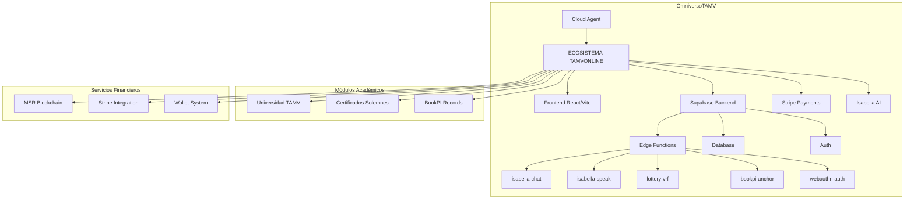
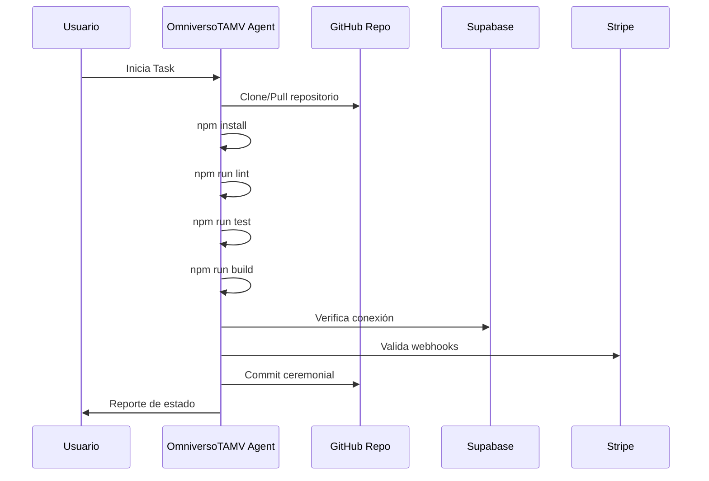

# 🌌 OmniversoTAMV Cloud Agent Configuration
## Configuración Oficial para Kilo Code Cloud Agent

**Fecha de creación:** 2026-01-19  
**Versión:** 1.0.0  
**Autor:** Edwin Oswaldo Castillo Trejo  
**Proyecto:** OmniversoTAMV - ECOSISTEMA-TAMVONLINE

---

## 📝 Task Description (Copiar en Cloud Agent)

```
Orquestar el OmniversoTAMV: integrar repositorios del ecosistema, validar módulos académicos, coordinar certificados solemnes, sincronizar servicios Supabase y Stripe, ejecutar pruebas de seguridad y preparar despliegue en Lovable. El agente debe instalar dependencias, compilar, correr tests y asegurar que todos los endpoints del ecosistema funcionen correctamente antes de cada commit.
```

---

## 📦 Repository Selection

| Campo | Valor |
|-------|-------|
| **Repository** | `OsoPanda1/ECOSISTEMA-TAMVONLINE` |
| **Branch Principal** | `main` |
| **Tipo** | Monorepo del OmniversoTAMV |

---

## 🔐 Environment Variables

```env
# ═══════════════════════════════════════════════════════════════
# SUPABASE CONFIGURATION - OmniversoTAMV
# ═══════════════════════════════════════════════════════════════
SUPABASE_URL=https://xxxx.supabase.co
SUPABASE_ANON_KEY=your-anon-key
SUPABASE_SERVICE_ROLE_KEY=your-service-role-key

# ═══════════════════════════════════════════════════════════════
# STRIPE CONFIGURATION - Pagos Solemnes
# ═══════════════════════════════════════════════════════════════
STRIPE_PUBLIC_KEY=pk_live_xxxxx
STRIPE_SECRET_KEY=sk_live_xxxxx
STRIPE_WEBHOOK_SECRET=whsec_xxxxx

# ═══════════════════════════════════════════════════════════════
# DOMAIN & DEPLOYMENT
# ═══════════════════════════════════════════════════════════════
NEXT_PUBLIC_DOMAIN=https://omniverso.tamv.io
VITE_APP_URL=https://omniverso.tamv.io

# ═══════════════════════════════════════════════════════════════
# ISABELLA AI CONFIGURATION (Opcional)
# ═══════════════════════════════════════════════════════════════
OPENAI_API_KEY=sk-xxxxx
ISABELLA_MODEL=gpt-4-turbo

# ═══════════════════════════════════════════════════════════════
# MSR BLOCKCHAIN (Opcional - Producción)
# ═══════════════════════════════════════════════════════════════
MSR_NETWORK_URL=https://msr.tamv.io/rpc
MSR_CHAIN_ID=tamv-msr-1
```

---

## ⚙️ Setup Commands

```bash
# Instalación de dependencias
npm install

# Validación de código (ESLint)
npm run lint

# Ejecución de tests (cuando estén configurados)
npm run test

# Compilación del proyecto
npm run build
```

### Comandos Adicionales Recomendados

```bash
# Desarrollo local
npm run dev

# Preview de build
npm run preview

# Verificación de tipos TypeScript
npx tsc --noEmit

# Formateo de código (si Prettier está configurado)
npm run format
```

---

## 👤 Profile Configuration

| Campo | Valor |
|-------|-------|
| **Profile Name** | `OmniversoTAMV Agent` |
| **Description** | Agente orquestador del ecosistema OmniversoTAMV |
| **Role** | Orquestador académico, financiero y técnico |

---

## 📊 Funciones del Agente OmniversoTAMV

### 1. Instalación y Validación
- ✅ Instala dependencias con `npm install`
- ✅ Valida calidad de código con `npm run lint`
- ✅ Verifica tipos TypeScript

### 2. Pruebas y Compilación
- ✅ Ejecuta pruebas unitarias e integración
- ✅ Compila el proyecto con `npm run build`
- ✅ Prepara visualización en Lovable

### 3. Validación de Módulos
- ✅ Valida certificados solemnes en endpoints
- ✅ Prueba integración Stripe con webhooks
- ✅ Verifica funciones de Supabase Edge Functions

### 4. Commits Ceremoniales
- ✅ Hace commits en rama de sesión
- ✅ Asegura coherencia en todo el ecosistema
- ✅ Documenta cambios con mensajes descriptivos

---

## 🏗️ Arquitectura del Ecosistema



---

## 📋 Checklist Pre-Commit

Antes de cada commit, el agente debe verificar:

- [ ] `npm install` ejecutado sin errores
- [ ] `npm run lint` pasa sin warnings críticos
- [ ] `npm run build` compila exitosamente
- [ ] Variables de entorno configuradas correctamente
- [ ] Funciones de Supabase desplegadas
- [ ] Endpoints de API respondiendo
- [ ] Tests pasando (cuando estén configurados)

---

## 🔗 Endpoints del Ecosistema

| Endpoint | Descripción | Estado |
|----------|-------------|--------|
| `/api/isabella/chat` | Chat con Isabella AI | 🟢 Activo |
| `/api/isabella/speak` | Síntesis de voz | 🟢 Activo |
| `/api/lottery/vrf` | Lotería con VRF | 🟢 Activo |
| `/api/bookpi/anchor` | Anclaje de registros | 🟢 Activo |
| `/api/auth/webauthn` | Autenticación WebAuthn | 🟢 Activo |

---

## 📁 Estructura de Archivos Clave

```
ECOSISTEMA-TAMVONLINE/
├── src/
│   ├── components/          # Componentes React
│   ├── core/               # Lógica central del ecosistema
│   │   ├── autodoc/        # Documentación automática
│   │   ├── emotion/        # Sistema EmotionBI
│   │   ├── federation/     # Arquitectura federada
│   │   ├── knowledge/      # Repositorio de conocimiento
│   │   ├── orchestrator/   # Orquestador del sistema
│   │   ├── quantum/        # API Quantum
│   │   ├── render4d/       # Renderizado 4D
│   │   ├── security/       # Capa de seguridad
│   │   └── sensors/        # Hub de sensores
│   ├── hooks/              # React hooks personalizados
│   ├── lib/                # Utilidades
│   ├── pages/              # Páginas de la aplicación
│   └── services/           # Servicios externos
├── supabase/
│   ├── functions/          # Edge Functions
│   └── migrations/         # Migraciones de DB
├── public/                 # Assets estáticos
└── plans/                  # Documentación de planes
```

---

## 🚀 Flujo de Trabajo del Agente



---

## 📌 Notas Importantes

1. **Seguridad**: Nunca exponer las claves secretas en el código fuente
2. **Commits**: Usar mensajes descriptivos con prefijos semánticos (feat:, fix:, docs:)
3. **Testing**: Ejecutar tests antes de cada merge a main
4. **Documentación**: Mantener actualizada la documentación del ecosistema

---

## 🎯 Próximos Pasos

1. Configurar el Task en Cloud Agent con los datos de este documento
2. Crear el perfil "OmniversoTAMV Agent"
3. Ejecutar primera validación del ecosistema
4. Verificar todos los endpoints funcionando
5. Realizar commit ceremonial inicial

---

*Documento generado para el OmniversoTAMV - TAMV ONLINE MSR Civilizational Stack*
